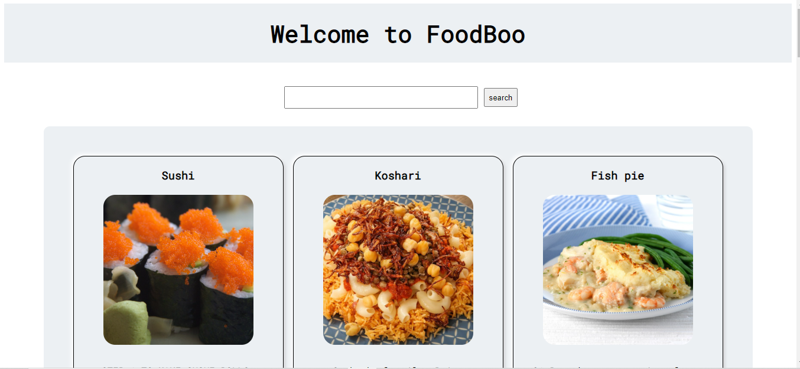
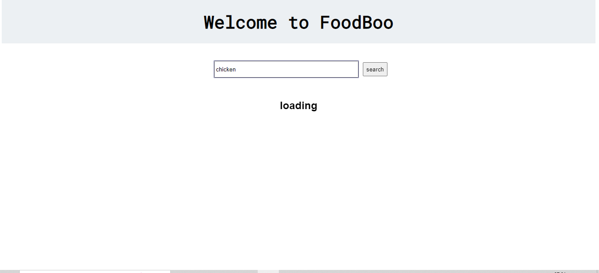

#Food Recipe in Vue
1.Uses  https://www.themealdb.com/api.php <a  href="https://www.themealdb.com/api.php"> visit api</a>   

<a href="https://www.foodboo.netlify.app">checkout project</a>

 
 

<a href="https://www.foodboo.netlify.app">visit project</a>
